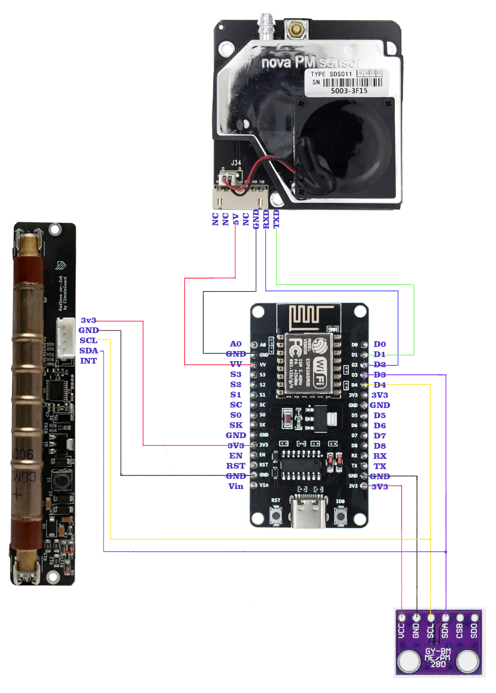
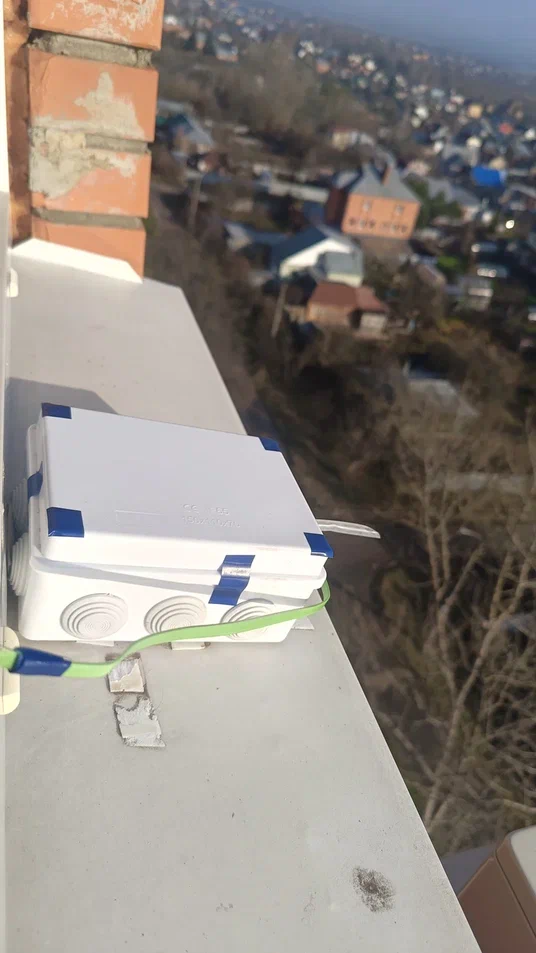
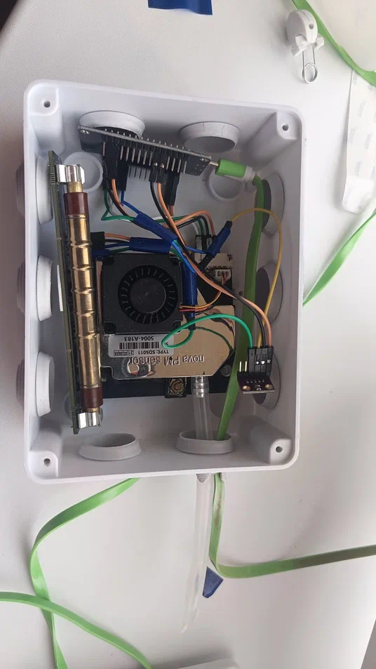

# WeatherStation
Станция мониторинга температуры/влажности/давления; качества воздуха (PM2.5, PM10); радиации
Отправляет данные на собственный сервер Home Assistant, Sensor Community, Народный Мониторинг (narodmon)

**Пути файлов:**

* esphome.yaml -> /config/esphome/esphome.yaml
* secrets.yaml  -> /config/esphome/secrets.yaml
* RadSens/RadSensComponent.h  -> /config/esphome/RadSens/RadSensComponent.h

В secrets.yaml заданы константы (пароли/пути) для отправки данных.
  
**Компоненты:**

- Микроконтроллер ESP8266 NODEMCU V3
- Модуль дозиметра RadSens V2v6
- BME280 - датчик измерения температуры/влажности/давления
- SDS011 - датчик измерения мелкодисперсной пыли (PM2.5, PM10)

**Схема подключения:**

**Фото:**

  
  

**Ссылки:**  

[Библиотека RadSens](https://github.com/climateguard/RadSens)  
[Документация ESPHome](https://esphome.io/index.html)  
[Народный Мониторинг (narodmon)](https://narodmon.ru/#)  
[Sensor Community](https://sensor.community/ru/)  
[Home Assistant](https://www.home-assistant.io/docs/)  
